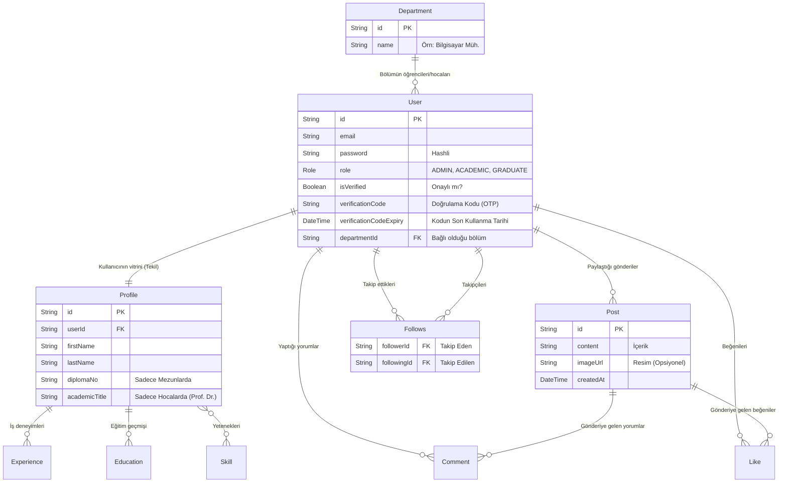

# 🎓 Mezun Takip Sistemi - Veritabanı Mimarisi

Bu proje **PostgreSQL** üzerinde çalışır ve **Prisma ORM** ile yönetilir. Aşağıdaki şema, sistemdeki tabloların (User, Department, Post vb.) birbiriyle nasıl konuştuğunu gösterir.

### 🗺️ İlişki Diyagramı (ER Diagram)

